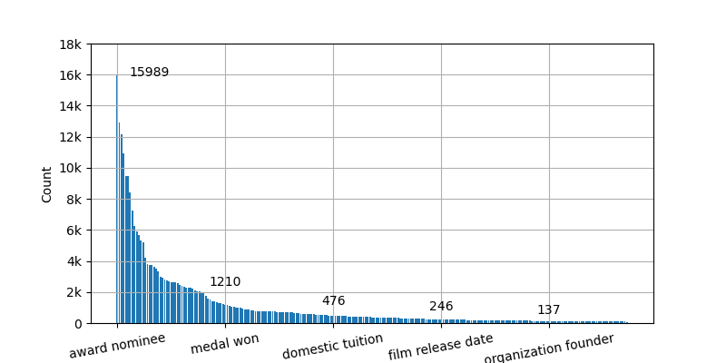

# MetaSD



## Get Started

All dependencies are listed in the `requirements.txt` file. `conda` is the recommended package manager. Run following commands to install all required packages.

```bash
# create a new enviroment metasd
conda create -n metasd python=3.8

# install dependencies
conda activate metasd
conda install --yes --file requirements.txt
```

## Training Recipes

### Preprocess the Datasets

To preprocess the datasets, run the following command.

```bash
python process_datasets.py
```

The processed datasets would be saved to the `data` directory.

### Reproduce the Results

To train model on the FB15k-237 dataset and the WN18RR dataset, use following provided training scripts.

```bash
# FB15k-237
sh scripts/metafb.sh

# WN18RR
sh scripts/metawn.sh
```

## Testing Recipes

We provide two testing modes, `dense inference` and `sparse inference`. To simply verify the model performance, the `dense mode` can finish evaluation without additional edition. You can set the value of `prune_percent` to control the parameter number need to be pruned.

```bash
# set your values in []
export CUDA_VISIBLE_DEVICES=[GPUID]

python metasd.py --dataset [Dataset] --batch_size 5000 --reg 5e-2 --prune_percent 0.8 --use_relaux True -save -id test -ckpt [Model Checkpoint Path]
```

To explore the sparsity model, it is required to convert dense model parameters to sparse model parameters. You can set the value of `prune_percent` to control the parameter number need to be pruned.

```bash
# set your values in []
export CUDA_VISIBLE_DEVICES=[GPUID]

python mask2sparse.py --dataset [Dataset] --prune_percent 0.8 -save -id test -ckpt [Model Checkpoint Path]
```

After conversion, run the model in sparse mode with:

```bash
# set your values in []
export CUDA_VISIBLE_DEVICES=[GPUID]

python metasd.py --dataset [Dataset] --batch_size 5000 --reg 5e-2 --prune_percent 0.8 --use_relaux True -save -id test -ckpt [Sparse Model Checkpoint Path] -sparse_infer
```
